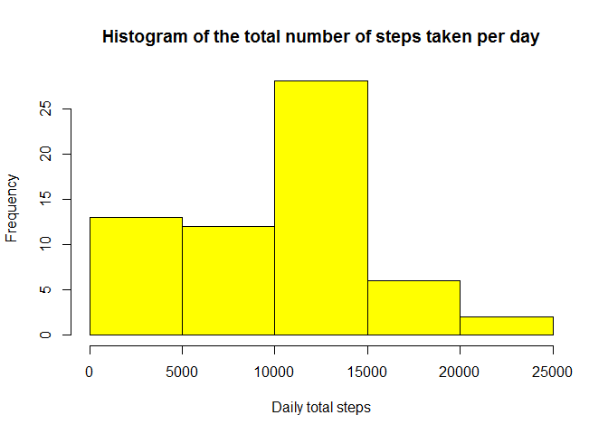
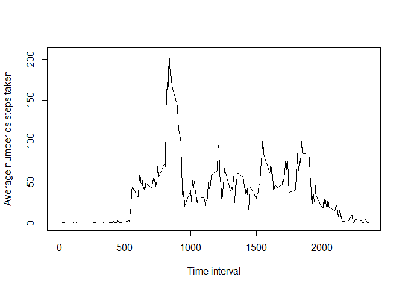
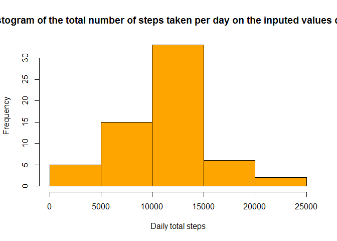
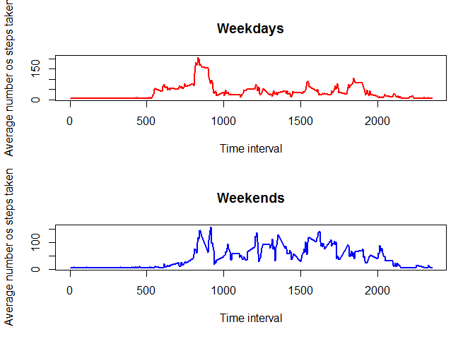

# Reproducible Research: Peer Assessment 1

## Loading and preprocessing the data

First the data is read into R and some modifications are made. More specifically, the date variable that was read as a string is transformed to the proper date format


```r
data <- read.csv(file = "activity.csv", 
                 stringsAsFactors = FALSE)

# Transforming the date variable from a string to a date format

library(dplyr)
```

```
## 
## Attaching package: 'dplyr'
```

```
## The following objects are masked from 'package:stats':
## 
##     filter, lag
```

```
## The following objects are masked from 'package:base':
## 
##     intersect, setdiff, setequal, union
```

```r
library(lubridate)

data <- mutate(data, date = ymd(date))
```

## What is mean total number of steps taken per day?

Using the _tapply_ function, the total number of steps for each day is calculated and a histogram is plotted with this information.
In the graph, we can see that on a daily basis, the more frequent total of steps is between 10,000 and 15,000. Also, there is not a lot of days with a huge amount of steps taken, less than 5 days have more than 20,000 steps. Finally, a substantial amount of days have a low number of total steps, with around 12 days having less than 5,000 steps counted.


```r
daily_total_steps <- tapply(data$steps, data$date, sum, na.rm = TRUE)

hist(daily_total_steps, 
     main = "Histogram of the total number of steps taken per day", 
     xlab = "Daily total steps", 
     col = "yellow")
```



The mean and median values reflects what we saw on the histogram. 


```r
c(mean(daily_total_steps), median(daily_total_steps))
```

```
## [1]  9354.23 10395.00
```


## What is the average daily activity pattern?

Now, using the _tapply_ function, the average number os steps is calculated for each time interval. At the line plot, we see a peak on the average between the time interval of 750 through 1,000. Moreover, very few steps, on average, are taken before the 500 minute interval. 


```r
interval_average_steps <- tapply(data$steps, data$interval, mean, na.rm = TRUE)

plot(names(interval_average_steps), interval_average_steps, type = "l", xlab = "Time interval", ylab = "Average number os steps taken")
```



```r
#Time interval with the maximum average steps
interval_average_steps[which.max(interval_average_steps)]
```

```
##      835 
## 206.1698
```


## Imputing missing values

Before considering any method of imputation, the total number of missing values is calculated (The TRUE values on the table)


```r
table(is.na(data$steps))
```

```
## 
## FALSE  TRUE 
## 15264  2304
```

The missing values are substituted by the average number of steps on the weekday, assuming that despite the days changing, the behavior through the weekdays are mostly the same.
To achieve this computation, first the day of the week is discovered for each date using the _weekdays_ function. Then a copy of the old data set is created. This is where the data will be modified. Finally, the mean for each weekday is calculated and with a _for_ loop, the missing values  of the variable steps are modified.


```r
data$weekdays <- as.factor(weekdays(data$date))

data_inputed <- data

weekdays_mean <- tapply(data$steps, data$weekdays, mean, na.rm = TRUE)

for (i in 1:nrow(data_inputed)) {
  if (is.na(data_inputed$steps)[i]) {
    data_inputed$steps[i] <- weekdays_mean[data_inputed$weekdays[i]]
  }
}

daily_total_steps_inputed <- tapply(data_inputed$steps, data_inputed$date, sum, na.rm = TRUE)
```

Another histogram is build for the modified data set. Comparing to the first histogram, changing the missing values for the mean number of steps for the respective weekday of the observation resulted in an increase of the frequencies on the center of the histogram (Between 5,000 and 15,000 daily total steps). The mean and median values, as expected, also increased.


```r
hist(daily_total_steps_inputed, 
     main = "Histogram of the total number of steps taken per day on the inputed values dataset", 
     xlab = "Daily total steps", 
     col = "orange")
```



```r
c(mean(daily_total_steps_inputed), median(daily_total_steps_inputed))
```

```
## [1] 10821.21 11015.00
```


## Are there differences in activity patterns between weekdays and weekends?

First, to compare if there is a difference in the activity patterns between weekdays and weekends, the variable categorized weekdays is created


```r
data_inputed$cat_week <- as.factor(ifelse(data_inputed$weekdays %in% c(levels(data_inputed$weekdays)[1],levels(data_inputed$weekdays)[4]), 1, 2))

levels(data_inputed$cat_week) <- c("Weekend", "Weekday")
```

To observe the comparison a panel plot is created with a line plot for each category. It seems that there is a increase on the average number of steps taken during the weekends. This likely  because people go out more / exercise more during weekends.


```r
par(mfrow = c(2,1))

plot(names(interval_average_steps), with(subset(data_inputed, cat_week == "Weekday"), tapply(steps, interval, mean)), 
     type = "l", 
     xlab = "Time interval", 
     ylab = "Average number os steps taken", 
     main = "Weekdays", 
     col = "Red",
     lwd = 2)

plot(names(interval_average_steps), with(subset(data_inputed, cat_week == "Weekend"), tapply(steps, interval, mean)), 
     type = "l", 
     xlab = "Time interval", 
     ylab = "Average number os steps taken", 
     main = "Weekends", 
     col = "Blue",
     lwd = 2)
```



